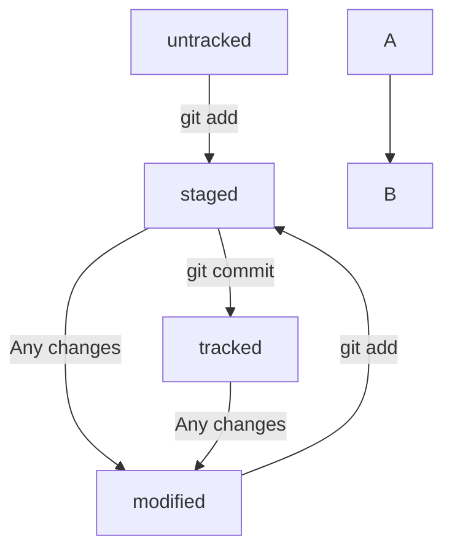

# Шпаргалка по git
---
## Навигация  
1. pwd (от англ. print working directory, «показать рабочую папку») — покажи, в какой я папке;  
2. ls (от англ. list directory contents, «отобразить содержимое директории») — покажи файлы и папки в текущей папке;  
3. ls -a — покажи также скрытые файлы и папки, названия которых начинаются с символа .;  
4. cd first-project (от англ. change directory, «сменить директорию») — перейди в папку first-project;  
5. cd first-project/html — перейди в папку html, которая находится в папке first-project;  
6. cd .. — перейди на уровень выше, в родительскую папку;  
7. cd ~ — перейди в домашнюю директорию (/Users/Username);  
8. cd / — перейди в корневую директорию.   
## Работа с файлами и папками    
### Создание   
1. touch index.html (англ. touch, «коснуться») — создай файл   
2. index.html в текущей папке;  
3. touch index.html style.css script.js — если нужно создать сразу несколько файлов, можно напечатать их имена в одну строку через пробел;  
4. mkdir second-project (от англ. make directory, «создать директорию») — создай папку с именем second-project в текущей папке.   
### Копирование и перемещение   
1. cp file.txt ~/my-dir (от англ. copy, «копировать») — скопируй файл в другое место;  
2. mv file.txt ~/my-dir (от англ. move, «переместить») — перемести файл или папку в другое место.    
### Чтение  
1. cat file.txt (от англ. concatenate and print, «объединить и распечатать») — распечатай содержимое текстового файла file.txt.    
### Удаление   
1. rm about.html (от англ. remove, «удалить») — удали файл about.html;  
2. rmdir images (от англ. remove directory, «удалить директорию») — удали папку images;  
3. rm -r second-project (от англ. remove, «удалить» + recursive, «рекурсивный») — удали папку second-project и всё, что она содержит.   
---
## Полезные возможности  
1. Команды необязательно печатать и выполнять по очереди. Можно указать их списком — разделить двумя амперсандами (&&) 

## Привязка к Github  
```bash  
git remote add origin 'SSH-код.git'  // привязка локального репозитория к удаленному  
```    
```bash  
git remote -v // проверка
```
```bash  
git push -u origin main // связывает локальную ветку с удаленной (потом без -u)
```

- Git преобразует информацию о коммитах с помощью алгоритма SHA-1 и для каждого из них рассчитывает уникальный идентификатор — хеш.  
- Хеш — основной идентификатор коммита и позволяет узнать его автора, дату и содержимое закоммиченных файлов.  
- Все хеши, а также таблицу соответствий хеш → информация о коммите Git хранит в папке .git.  

```bash    
git log // список коммитов
```  
```bash  
git log --oneline // сокращенный список коммитов 
```  

файл HEAD - хеш последнего коммита (ссылается на refs/heads/master)  

[Статусы git](https://pictures.s3.yandex.net/resources/M2_T5_1686651284.png)  
- Статусом untracked помечается файл, о существовании которого Git знает, но не следит за изменениями в нём. Этот статус — противоположность tracked, в который попадают все файлы, отслеживаемые Git.  
- Файл переходит в статус staged после выполнения git add.  
- Статус modified означает, что файл был изменён.  
- Большинство файлов в проектах «шагает» по следующему циклу: «изменён» → «добавлен в список на коммит» → «закоммичен» → «изменён» → и так далее.  

```bash  
git status // узнать состояние файла
```   


